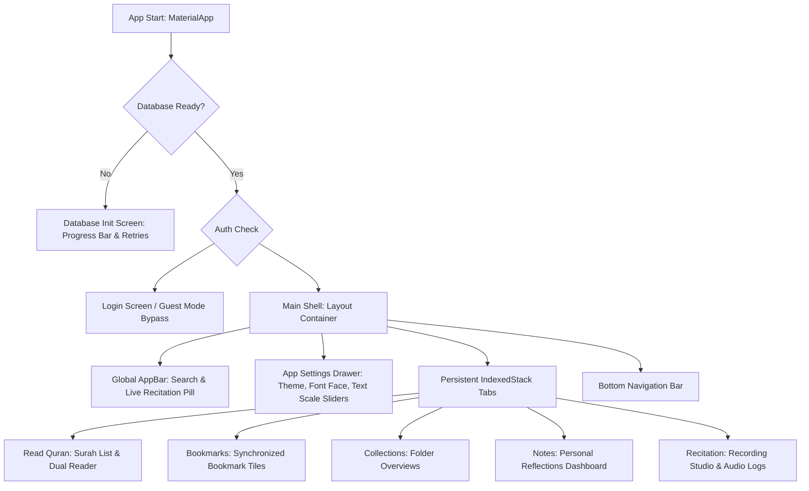

# Mushaf Konnekt Backend

# Mushaf Konnekt — Complete Project & Codebase Documentation
## Note: This is the backend repository, the frontend client (FLutter) is closed source for now

* **GitHub Repository**: [mshirazkamran/mushaf-konnekt-core](https://github.com/mshirazkamran/mushaf-konnekt-core)
* **Download Latest Releases**: [mushaf-konnekt-core/releases](https://github.com/mshirazkamran/mushaf-konnekt-core/releases)
* **Demo Video**: [mshiraz.tech/hackathon/demo-video](https://mshiraz.tech/hackathon/demo-video/)

Mushaf Konnekt is an offline-first Quranic reading and speech-recognition companion designed for mobile platforms (Android). By combining advanced on-device Automatic Speech Recognition (ASR), local fuzzy-string matching, local database caching with integrity checks, and cloud-synchronized user accounts, the app provides a premium, responsive, and seamless spiritual experience.

This document outlines the product features, user guide, UI structure, design patterns, and synchronization workflows for both technical and non-technical stakeholders in a tech firm.

---

## 💼 Core Features & User Guide

### 1. Dynamic Onboarding & Resource Loader
* **User Experience (Non-Technical)**: On the first launch, the app displays a modern, animated loading dashboard. It downloads necessary Arabic text and translation databases, showing a real-time progress bar, downloading speed, and file sizes. If the connection fails, it displays an error card with a simple, gradient "Retry" button.
* **Engineering Design (Technical)**: To keep the initial App Store download under 30MB, SQLite database files are excluded from the bundled assets. The app queries a startup status provider, downloads the files using atomic operations (downloading to `.tmp` files and swapping only after download completion to prevent corruption), and validates integrity against a local database expiry table. Progress metrics are proportionally weighted between the primary Quran database (80%) and the footnotes database (20%).
* **Content API & Database Caching Protocol (Hybrid)**:
  * *Data Retrieval*: The app retrieves verses, translations, and word-by-word meanings powered by the Quran Foundation Content API.
  * *End-User Device Caching*: To guarantee swift offline access and minimize cellular data consumption, the downloaded content is cached on the user's device for exactly **6 days**.
  * *Rolling Backend Updates*: Once the 6-day period expires, the app re-fetches the database file. To keep the data completely fresh, the custom proxy server (`qf-proxy`) queries the Quran Foundation source API and updates its own database copies on a rolling **6-day cycle**.

### 2. Dual-Mode Quran Reader
The core of the app is an interactive reader supporting two distinct visual layouts:
* **Reading Mode (Fluid Page Layout)**:
  * *How to Use*: Displays the Quranic text in a traditional, continuous book layout. Tapping any individual Arabic word triggers a light haptic pulse and opens a popup card translating that specific word in the user's language (English, Urdu, or Indonesian).
  * *Purpose*: Optimized for fluent recitation and absorption of word-by-word meanings.
* **Verse-by-Verse Mode (Detailed List Layout)**:
  * *How to Use*: Displays verses in a vertical card-based list. Underneath each verse, translation blocks and word meanings are fully displayed. Tapping a verse reveals a bottom action bar with three options: **Bookmark**, **Add to Collection**, or **Take Notes**.
  * *Features & Interactivity*:
    * **Syncing & Reflections**: Tapping **Take Notes** opens a bottom sheet to write reflective thoughts linked to that verse. **Add to Collection** allows grouping the verse into user-defined playlists (e.g., "Verses on Patience").
    * **Footnote Engine**: Whenever a translation contains an explanatory footnote indicator (e.g., standard superscript indicators), the app renders it as a styled, clickable icon. Tapping it queries the local database and displays a scrollable card containing the translator's explanation.
    * **Visual Navigation Pulse**: When navigating to a verse from search results or voice recognition matches, the app scrolls smoothly to the target verse and flashes a gentle 2-second gold highlight to direct the user's attention.

### 3. Voice-to-Ayah Recitation Matcher
* **User Experience (Non-Technical)**: Users tap a glowing microphone button to record their recitation. As they speak, a transcription pill slides in, showing that the system is listening and processing. Once finished, the app identifies the verse, displays the matched text, and shows a color-coded confidence score (Green for high accuracy, Orange for moderate, and Red for low). Users can save recordings, search their recitation history, and play back audio files inside the app.
* **Engineering Design (Technical)**: The ASR engine uses **Sherpa ONNX** running a quantized **Tarteel Speech Model** on-device. Audio capture, preprocessing, and model inference are offloaded to a background thread (**Dart Isolate**) to preserve a buttery-smooth 60+ FPS UI. A 350ms buffer-flush delay prevents audio cutting at word boundaries. Transcriptions are compared against database verses using a trigram-anchored sliding window search with Levenshtein distance matching. Recorded audio files are stored in `.wav` format in local app storage.

### 4. Customization & Settings Drawer
* **User Experience (Non-Technical)**: Accessible via the menu icon on the AppBar. Users can customize their environment with:
  * **Theme Switcher**: Instant switching between Light, Dark (low light), and Sepia (warm paper, optimized for long reading sessions).
  * **Font Family Selection**: Select specialized Quranic scripts including classic calligraphic style, Uthmani script, and digital variants.
  * **Text Scaling Sliders**: Independent sliders for Arabic and translation sizes, featuring a live text preview window.
  * **Account Control Hub**: Displays profile information, sign-out actions, and synchronization status.
* **Engineering Design (Technical)**: User settings are persisted locally via `SharedPreferences`. Changes to themes, fonts, or text sizes trigger state notifications using Riverpod providers, causing all active widgets to repaint dynamically without requiring an app reload.

### 5. Seamless Cloud Syncing & Authentication
* **User Experience (Non-Technical)**: Users can sign in securely using their Quran.com credentials. Signing in syncs personal data—bookmarks, collections, and reflection notes—across devices. Guest mode allows offline reading and recitation matching, but sync features are disabled, displaying a friendly login prompt when accessed.
* **Engineering Design (Technical)**: Authentication uses OAuth2 with Proof Key for Code Exchange (PKCE) and SHA-256 challenges, obtaining a secure session token via a backend proxy. This token is persisted in the device's secure hardware store (`flutter_secure_storage`).

---

## 📐 User Interface (UI) Structure

The app's interface is organized into a clean, hierarchical layout engineered for responsive navigation and state persistence:

### 1. The Application Shell (`MainShell`)
The primary shell wraps the main interface, keeping core bars consistent across views:
* **The Global AppBar**:
  * Displays the app title and contains a search button that opens a contextual search bar.
  * Houses the **Live Recitation Pill**: A sliding indicator that appears dynamically if speech transcription is running in the background, ensuring the user is always aware of microphone activity.
* **The Bottom Navigation Bar**:
  * Provides quick switching between the five main screens (Read, Bookmarks, Collections, Notes, Recite).
  * Implements *Guest Interception*: Tapping Bookmarks, Collections, or Notes while in guest mode blocks access and triggers a floating notification prompting the user to sign in.
* **Persistent Tab State (`IndexedStack`)**:
  * Instead of rebuilding tabs on every tap, screens are held in memory. This ensures that scroll positions, search query inputs, and current states are kept intact when switching tabs.
  * Transitions are animated using a smooth 220ms cross-fade animation.

### 2. Collapsible Settings Drawer
Allows quick, non-intrusive adjustments. Built as a standard side menu, it slides out from the left edge of the screen, housing controls for themes, fonts, text scale sliders, and accounts.

### 3. Mushaf Reader layout
The reading interface handles the complex rendering of flowing Arabic text, superscript footnote buttons, haptic feedback on word-tap, and verse selection highlights.

---

## 👆 Swipe-to-Delete User Experience (UX)

To keep dashboards uncluttered, Mushaf Konnekt integrates intuitive, fluid swipe-to-delete gestures for user data.

### 1. Visual Presentation
Items that can be deleted (bookmarks, collection cards, notes, collection items, and audio logs) are wrapped in custom swipable containers.
* **The Gesture**: Swiping an item from right to left (end-to-start) slides the card away.
* **The Visual Feedback**: As the item slides, it reveals a high-contrast crimson background with a white garbage can icon, signaling deletion.

### 2. Behavioral Logic (Immediate vs. Confirmed)
The swipe-to-delete behavior differs based on the criticality of the content:

* **Immediate Deletion with SnackBar Feedback**:
  * *Applies to*: **Bookmarks**, **Reflective Notes**, and **Collection Items** (individual verses inside a collection).
  * *Behavior*: The swipe immediately dismisses the card and triggers the deletion. A floating, rounded SnackBar appears at the bottom of the screen (e.g., "Bookmark removed" or "Note deleted") to provide instant visual confirmation of the change.
* **Confirmed Deletion Safety Gate**:
  * *Applies to*: **Collections** (which act as folders containing multiple items).
  * *Behavior*: Swiping a Collection triggers a modal dialog asking: *Delete "Collection Name"? This cannot be undone.*
  * *Purpose*: Prevents accidental deletion of entire playlists of verses. If the user selects "Cancel," the card slides back into place unharmed; if they select "Delete," the folder is removed, and a SnackBar confirms the action.

### 3. Technical Implementation
* **Widget Lifecycle**: Implemented using Flutter's built-in `Dismissible` widget. The widget monitors swipe gestures, handles the background slide animations, and provides hooks for confirmation (`confirmDismiss`) and finalization (`onDismissed`).
* **State & Sync**: In the `onDismissed` callback, the app dispatches an asynchronous call to the respective Riverpod state provider (e.g., `bookmarksProvider.notifier.deleteBookmark(id)`). The provider deletes the item from the local SQLite cache and dispatches an online request to the backend proxy.

---

## 📡 Remote Synchronization & API Design

Mushaf Konnekt uses an offline-first synchronization strategy, allowing users to modify notes and bookmarks offline and automatically sync changes when network access is available.

### 1. Authentication & Security
Requests made to the backend pass through a secure reverse-proxy path (`/qf-proxy`). Authorized requests include the user's JWT session token in the HTTP authorization headers.

### 2. Targeted Quran Foundation Endpoints
All sync operations route through the reverse-proxy path (`/qf-proxy`). The following endpoints are implemented to sync local offline states with the remote database:

#### Bookmarks
* `GET /bookmarks`: Retrieves the list of bookmarks saved by the user.
* `POST /bookmarks`: Saves a new verse bookmark.
* `DELETE /bookmarks/{bookmark_id}`: Removes a saved bookmark.
* `GET /bookmarks/collections`: Retrieves user collections metadata associated with bookmarks.

#### Collections
* `GET /collections`: Fetches the user's custom collection folders (paginated).
* `GET /collections/all`: Fetches all collection folders at once.
* `GET /collections/{collection_id}`: Fetches details of a specific collection folder.
* `POST /collections`: Creates a new custom collection folder.
* `PUT /collections/{collection_id}`: Renames or updates an existing collection folder.
* `POST /collections/{collection_id}/bookmarks`: Adds a bookmarked verse to a collection folder.
* `DELETE /collections/{collection_id}/bookmarks`: Removes all items from a collection folder.
* `DELETE /collections/{collection_id}/bookmarks/{bookmark_id}`: Removes a specific bookmarked verse from a collection folder.

#### Notes & Reflections
* `GET /notes`: Retrieves all notes and reflections written by the user.
* `POST /notes`: Saves a new reflection note for a verse or verse range.
* `GET /notes/{note_id}`: Retrieves details of a specific reflection note.
* `PUT /notes/{note_id}`: Fully updates and overwrites the text of a reflection note.
* `PATCH /notes/{note_id}`: Modifies part of an existing reflection note.
* `DELETE /notes/{note_id}`: Deletes a reflection note.
* `GET /notes/by-verse/{verse_key}`: Fetches notes associated with a specific verse.

### 3. Query Optimization & Payload Design
To ensure fast responses on mobile connections:
* **Pagination**: Lists of bookmarks, collections, and note items are paginated (fetching in batches of 20) to prevent overloading database queries.
* **Format-agnostic Proxies**: The API proxy forwards responses back to the Flutter frontend unchanged, maintaining high performance and decoupling the app's database formats from API schema details.

**Portfolio:** https://mshiraz.tech
